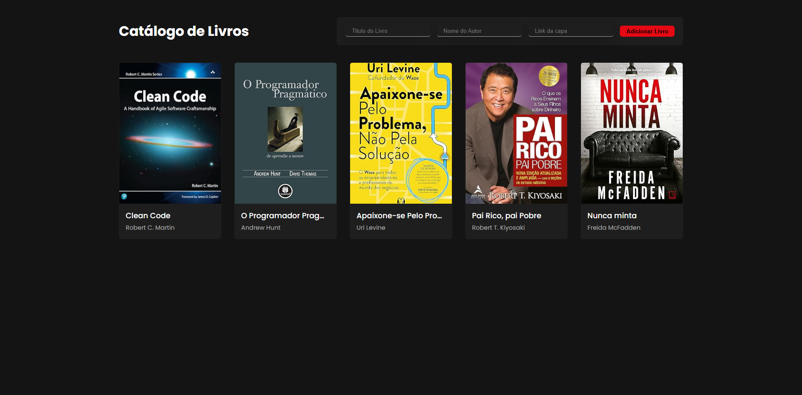

# 📖 Catálogo de Livros

Uma aplicação web responsiva que permite adicionar, exibir e remover livros com capa, título e autor. Os dados são armazenados localmente no navegador com `localStorage`, garantindo que o catálogo permaneça intacto mesmo ao recarregar a página.

## ✨ Funcionalidades

* Adicionar novos livros com capa (link), título e autor
* Exibir uma galeria de livros com visual moderno
* Remover livros individualmente
* Persistência com `localStorage`
* Estilização responsiva com CSS moderno&#x20;

## 📁 Tecnologias utilizadas

* HTML5
* CSS3 (Flexbox e Grid)
* JavaScript (DOM, eventos, localStorage)

## 📷 Preview

